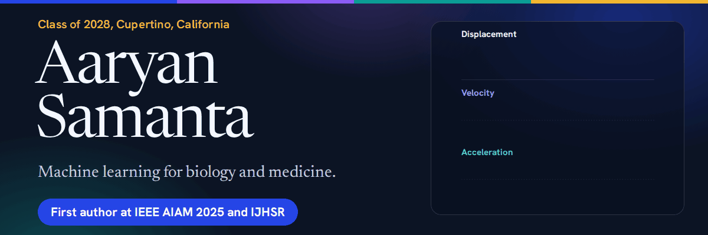
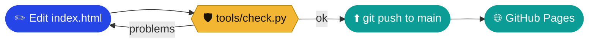

<div align="center">



<br>

<a href="https://aaryansamanta.github.io/"></a>
<a href="https://aaryansamanta.github.io/aaryan-samanta-resume.pdf"></a>
<a href="https://scholar.google.com/citations?user=TboJyScAAAAJ"></a>
<a href="https://orcid.org/0009-0005-6381-4890"></a>
<a href="https://github.com/aaryansamanta/ai-research-publications"></a>

<br>


<br><br>

**Personal site of Aaryan Samanta: research, competitions, and the organizations I run.**

</div>

---

## ✨ What this is

One fast static page that makes a record easy to check. Every number is specific, linked to a public source where one exists, and unfinished work is marked with a hollow dot instead of being dressed up as a result.

- 🪶 **No build step, no framework, no trackers, no third-party requests.** Fonts are self-hosted.
- 🌗 **Light and dark themes**, keyboard-friendly, respects reduced motion, prints cleanly.
- 🧩 **Works without JavaScript.** The script only adds a nav highlight, an interactive hero figure, and copy buttons for BibTeX.
- ✅ **Guarded by a checker** that fails on a broken link, a phone number, an unexpected email, or placeholder text.

> [!TIP]
> Open the live site and drag across the curves in the hero. They are the displacement, velocity and acceleration curves behind my Stanford project, and the banner above animates the same idea.

## 🧭 What is on the page

| | Section | What it holds |
|:-:|---|---|
| 🏠 | **Hero** | Selected results, and a figure you can drag across to read displacement, velocity and acceleration |
| 🔬 | **Research** | Papers with a copy-BibTeX button, mentored research, projects |
| 🏆 | **Competitions** | Results with the field size where I know it |
| 🏗️ | **Building and leading** | AI Ethos, NextGenAI, CogArc, teams and service |
| 🏃 | **Outside the classroom** | Track, band, languages |
| 🎓 | **Academics** | School, scores, recognition, coursework capstones |
| 🔗 | **Sources** | Where each claim can be checked, or that records are available on request |

## 🎨 Design

| | |
|---|---|
| **Type** | Newsreader for reading and display, Hanken Grotesk for labels and data |
| **Palette** |      |
| **Status dots** | ● filled blue = done · ● filled teal = accepted · ○ hollow = ongoing, in progress, under review |

## 🔄 How a change ships



## 🗂️ Repository layout

```
index.html                     the whole site: semantic HTML, JSON-LD for search engines
404.html                       custom not-found page
aaryan-samanta-resume.pdf      linked from the hero and contact section (keep this filename)
assets/css/style.css           design tokens, layout, components, dark mode, print styles
assets/js/main.js              optional enhancements (see above)
assets/fonts/                  Newsreader + Hanken Grotesk (variable, latin subset, SIL OFL)
assets/img/                    favicon, touch icon, social preview, animated README banner
robots.txt, sitemap.xml        search engine hints
tools/check.py                 offline checks: links, ids, status labels, privacy, placeholders, dates
tools/build_resume.py          regenerates the resume PDF in the site's own fonts
tools/build_banner.py          regenerates the animated README banner
docs/CONTENT-GUIDE.md          how to add or change an entry, and the rules I follow
.github/workflows/check.yml    runs tools/check.py on every push and pull request
```

## 🚀 Preview locally

```bash
python3 -m http.server 8000
# open http://localhost:8000
python3 tools/check.py        # run before every commit
```

## ✍️ Updating content

Everything lives in `index.html`. Each entry is one `<article class="row">` (Research, Building, Outside the classroom) or one `<li>` (Competitions). Copy a nearby entry and edit it. The full guide, including the status labels and the rules for promoting an item from "in progress" to "done", is in [`docs/CONTENT-GUIDE.md`](docs/CONTENT-GUIDE.md).

After any edit that changes content:

1. Update the footer `<time>` and the JSON-LD `dateModified` in `index.html`.
2. Update `lastmod` in `sitemap.xml` (`tools/check.py` fails if these disagree).
3. If the change belongs on the resume, edit `tools/build_resume.py` and run it.
4. If a headline result changed, edit the `facts` chips in `tools/banner/banner.html` and run `tools/build_banner.py`.
5. Run `python3 tools/check.py`, then click any external link you added or changed.

> [!IMPORTANT]
> Only completed results go in as results. Plans and targets do not. If two files disagree about a number, settle it once and update everything that repeats it.

## 📄 Rebuilding the resume PDF

```bash
pip install -r tools/requirements.txt
python3 tools/build_resume.py
```

This overwrites `aaryan-samanta-resume.pdf` in place, so links to it keep working. The PDF deliberately has no phone number and no reference contact details.

## 🎞️ Rebuilding the banner

```bash
pip install playwright pillow && playwright install chromium
python3 tools/build_banner.py
```

Renders 72 frames of `tools/banner/banner.html` and writes `assets/img/readme-banner.gif` (about 0.25 MB).

## 🌐 Deploying

This repository is a GitHub Pages **user site**, so it must be named exactly `aaryansamanta.github.io`.
Settings, Pages, Source: **Deploy from a branch**, branch `main`, folder `/ (root)`. The site is live within a minute of each push.

> [!WARNING]
> Do not add a `CNAME` file unless you intend to move the site to a custom domain. It would redirect this address.

## ⚖️ License

- **Code** (HTML structure, CSS, JavaScript, tools): MIT, see `LICENSE`.
- **Written content, resume and personal data:** all rights reserved.
- **Fonts:** SIL Open Font License, see `assets/fonts/`.

<div align="center">

<br>

   

<sub>Built by hand, checked by script. Updated September 2026.</sub>

</div>
